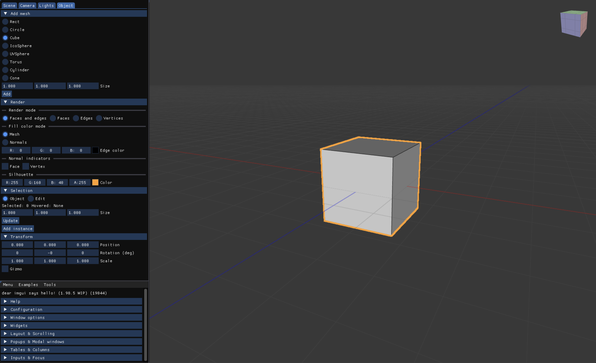
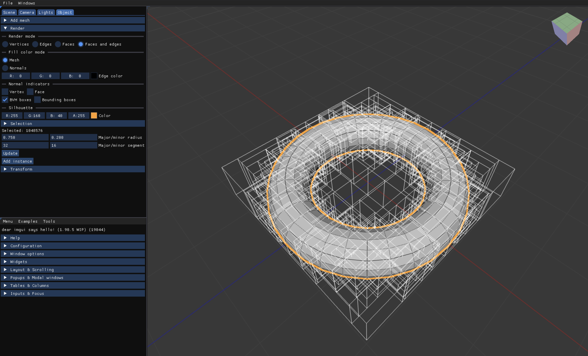

# MeshEditor

Real-time mesh viewer and editor, using Vulkan and ImGui.




For me to learn Vulkan.
I'm also aiming to port [mesh2audio](https://github.com/khiner/mesh2audio) from OpenGL to Vulkan directly in this project.

## Features

Features so far:
* Create/delete meshes and mesh instances
  - Editable mesh primitives (Rect, Circle, Cube, IcoSphere, UVSphere, Torus, Cylinder, Cone)
  - Load `.obj`, `.off`, `.ply`, `.stl` and `.om` mesh files (via [OpenMesh](https://gitlab.vci.rwth-aachen.de:9000/OpenMesh/OpenMesh))
* Select meshes or mesh elements (vertices, edges, or faces) with mouse
* Flat/smooth/wireframe mesh rendering
* Bounding Volume Hierarchy (BVH) ray intersection acceleration structure
  - Used for mouse interactions - this is not a ray tracing renderer :)
* Translate / rotate / (nonuniformly) scale meshes and instances with [gizmo]([ImGuizmo](https://github.com/CedricGuillemet/ImGuizmo)) and numeric inputs
* Simple camera + scene lighting model, roughly matching Blender visually
* Edit camera with:
  - Camera rotate cube [gizmo]([ImGuizmo](https://github.com/CedricGuillemet/ImGuizmo))
  - Scrollwheel zoom
  - Numeric inputs
* Edit lighting parameters
* Render face/vertex normals as lines for debugging
* Render bounding box / BVH wireframes for debugging
* Edge-detection-based silhouette outline of selected mesh/instance, embedded into the scene with accurate per-pixel depth
* Fast infinite grid with horizon fade

Noteworthy dev bits:
* Terse and direct usage of [Vulkan-Hpp](https://github.com/KhronosGroup/Vulkan-Hpp)
* Change SPIRV shader code and trigger a runtime recompile in the UI
* Resource reflection: Use [`SPIRV-Cross`](https://github.com/KhronosGroup/SPIRV-Cross) to automatically create descriptor set layout bindings for all shader pipelines
* Instanced rendering of shared geometry with variable transforms

## Build app

### Install dependencies

- Download and install the latest SDK from https://vulkan.lunarg.com/sdk/home
- Set the `VULKAN_SDK` environment variable.
  For example, add the following to your `.zshrc` file:
  ```shell
  export VULKAN_SDK="$HOME/VulkanSDK/{version}/macOS"
  ```

#### Mac

```shell
$ brew install cmake pkgconfig llvm
$ brew link llvm --force
```

#### Linux

(Only tested on Ubuntu.)

```shell
$ sudo apt install llvm libc++-dev libc++abi-dev
$ ln -s llvm-config-17 llvm-config
$ export PATH="$(llvm-config --bindir):$PATH"
```

Install GTK (for native file dialogs):

```shell
$ sudo apt install build-essential libgtk-3-dev
```

### Clone, clean, and build app

```shell
$ git clone --recurse-submodules git@github.com:khiner/MeshEditor.git
$ cd MeshEditor
$ mkdir build && cd build && cmake .. && make
```

## Stack

- [ImGui](https://github.com/ocornut/imgui) + [SDL3](https://github.comlibsdl-org/SDL) + [Vulkan](https://www.vulkan.org/): Immediate-mode UI/UX
- [glm](https://github.com/g-truc/glm): Graphics math
- [OpenMesh](https://gitlab.vci.rwth-aachen.de:9000/OpenMesh/OpenMesh): Main polyhedral mesh data structure
- [entt](https://github.com/skypjack/entt): Entity Component System (ECS) for an efficient and scalable mixin-style architectural pattern
- [VulkanMemoryAllocator](https://github.com/GPUOpen-LibrariesAndSDKs/VulkanMemoryAllocator): Efficient Vulkan memory allocation
- [nativefiledialog-extended](https://github.com/btzynativefiledialog-extended): Native file dialogs
- [ImGuizmo](https://github.com/CedricGuillemet/ImGuizmo): Mesh transform and camera rotation gizmos
