# Mesh Audio Editor

Real-time mesh viewer and editor supporting conversion of meshes to rigid body audio models using Linear Modal Analysis/Synthesis.


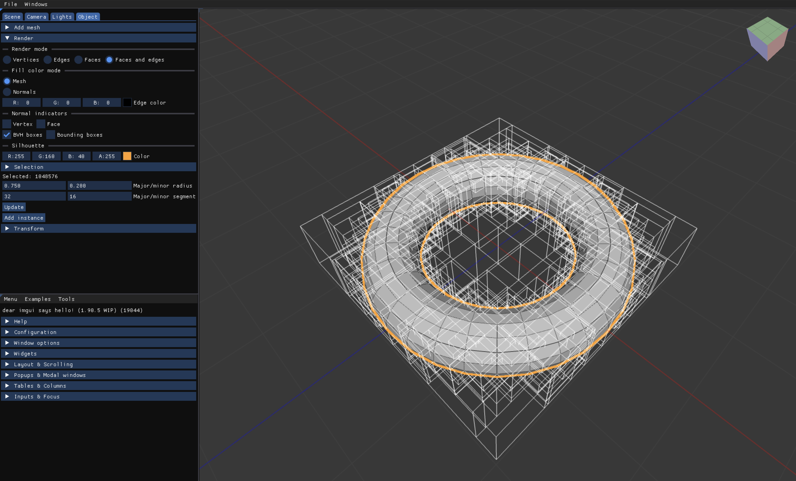
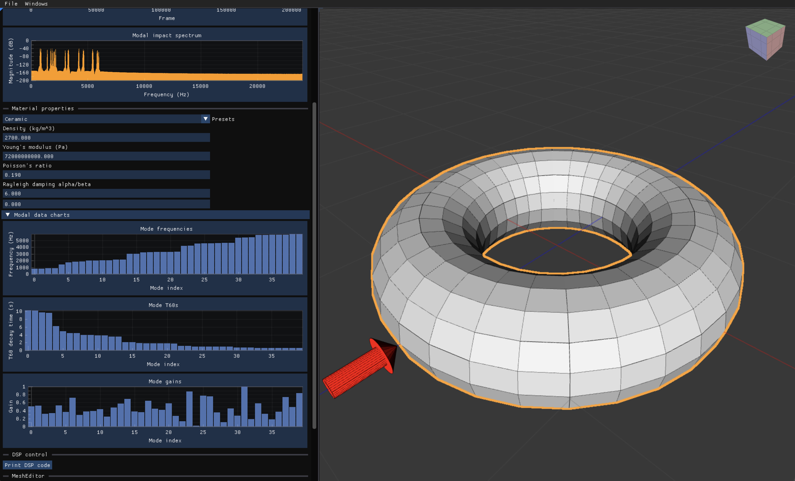
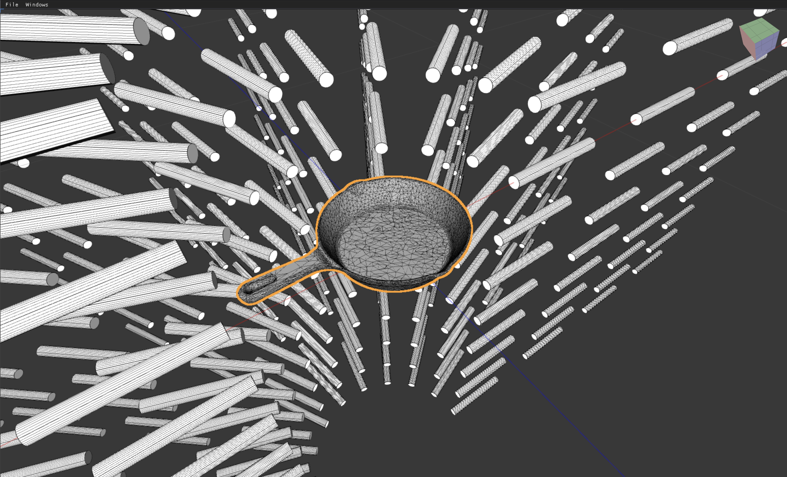
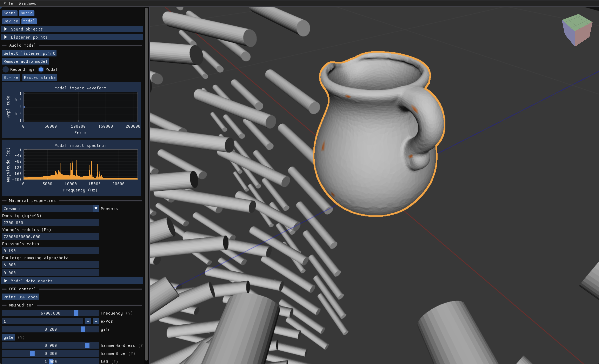
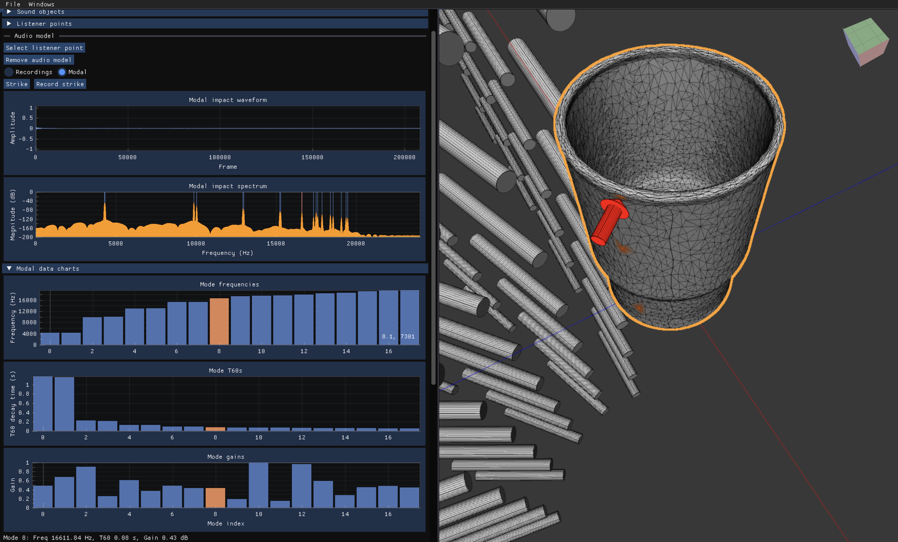

### Features

General features:
* Create/delete meshes and mesh instances
  - Editable mesh primitives (Rect, Circle, Cube, IcoSphere, UVSphere, Torus, Cylinder, Cone)
  - Load `.obj` and `.ply` mesh files (via [tinyobjloader](https://github.com/tinyobjloader/tinyobjloader) and [tinyply](https://github.com/ddiakopoulos/tinyply))
* Select meshes or mesh elements (vertices, edges, or faces)
* Flat/smooth/wireframe mesh rendering
* Bounding Volume Hierarchy (BVH) ray intersection acceleration structure
  - Used for mouse interactions - this is not a ray tracing renderer :)
* Translate / rotate / (nonuniformly) scale meshes and instances with numeric inputs or a custom transform gizmo designed to look and behave just like Blender's
* Simple camera + scene lighting model, roughly matching Blender visually
* Edit camera with mouse wheel, numeric inputs, or with a custom orientation gizmo designed to look and behave just like Blender's
* Edit lighting parameters
* Render face/vertex normals as lines for debugging
* Render bounding box / BVH wireframes for debugging
* Edge-detection-based silhouette outline of active mesh/instance, embedded into the scene with accurate per-pixel depth
* Fast infinite grid with horizon fade

Audio-specific features:
* Enable/disable audio output and change device and native format/sample rate
* Volume / Mute
* Generate an efficient physical audio model for any mesh. (See [Physical audio modeling](#physical-audio-modeling).)
  - Click on an audio mesh to excite the nearest vertex, or trigger a selected vertex in the audio menu
  - Edit model DSP params in real-time (via an embedded ImGui Faust parameter editor)
  - View/navigate the generated audio graph (via an embedded Faust SVG diagram navigator)
* Load [RealImpact](https://samuelpclarke.com/realimpact/) datasets, including the object mesh and instanced cylinders for each microphone position.

Noteworthy dev bits:
* Terse and direct usage of [Vulkan-Hpp](https://github.com/KhronosGroup/Vulkan-Hpp)
* Shader hot reloading: Edit shader code and recompile/reload GLSL->SPIRV at runtime in the UI
* Resource reflection: Use [`SPIRV-Cross`](https://github.com/KhronosGroup/SPIRV-Cross) to automatically create descriptor set layout bindings for all shader pipelines
* Instanced rendering of shared geometry with variable transforms

### Physical audio modeling

This project supports generating an efficient physical audio model for any mesh using Linear Modal Analysis/Synthesis

The physical audio modeling components were implemented as a final project for PHYS-6260 - Computational Physics at Georgia Tech during my Master's, and this is the final report. [Here is the final report paper](paper/PAMofPassiveRigidBodies.pdf).

And here is a 36X48 poster:

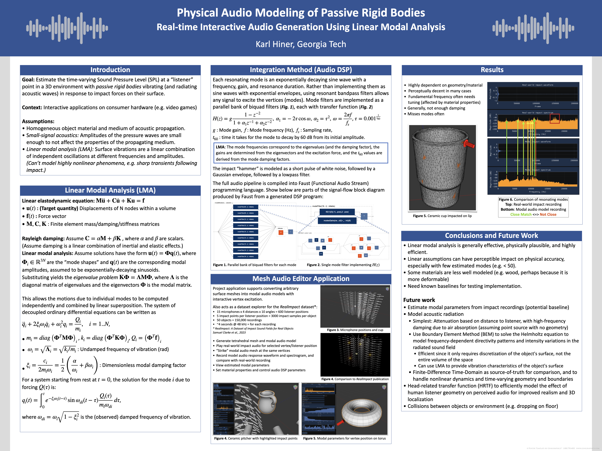

#### Impact audio experiments

Below are audio examples synthesized by "striking" modal audio models (by injecting a short wideband pulse at the selected vertex) for various meshes, with comparisons to impact recordings of their real-world counterparts being struck at the same position.
The audio recordings and 3D-scanned meshes come from the [RealImpact](https://samuelpclarke.com/realimpact/) dataset.
See [the blog post](https://karlhiner.com/mesh_audio_editor) for embedded audio players.

_The cylinders shown in the images represent recorded microphone positions, but all recordings come from a single microphone centered near the impacted object, and the modal audio model does not implement any audio wave radiation modeling. All modal audio samples are generated by extracting estimated surface vibrations, as if recorded from a contact microphone._

| Object Name | Mesh | Real Impact Audio | Modal Impact Audio |
|-|-|-|-|
| Ceramic Koi Bowl | 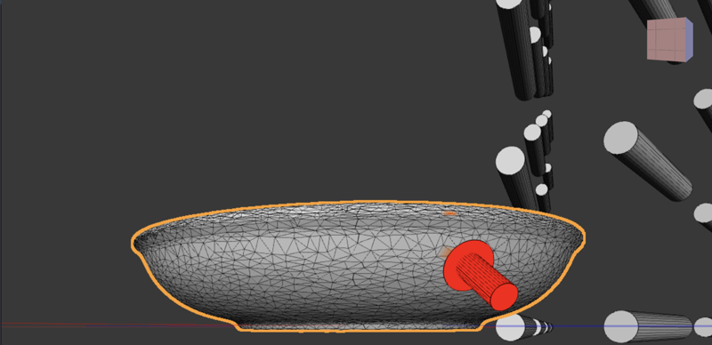 | [Impact](audio_samples/CeramicKoiBowlImpact.wav) | [Modal](audio_samples/CeramicKoiBowlModal.wav) |
| Ceramic Pitcher | 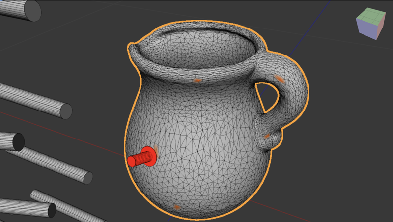 | [Impact](audio_samples/PitcherCeramicImpact.wav) | [Modal](audio_samples/PitcherCeramicModal.wav) |
| Glass Cup | 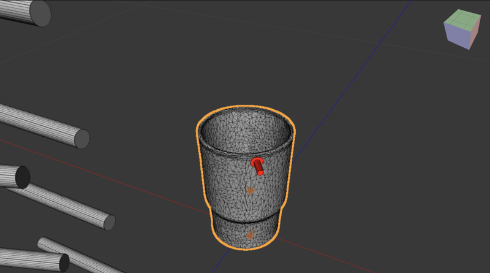 | [Impact](audio_samples/CupImpact.wav) | [Modal](audio_samples/CupModal.wav) |
| Iron Mortar | 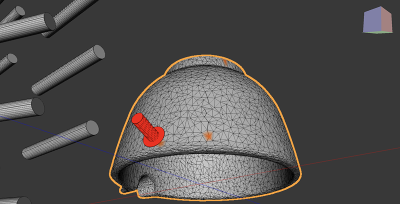 | [Impact](audio_samples/IronMortarImpact.wav) | [Modal](audio_samples/IronMortarModal.wav) |
| Iron Skillet | 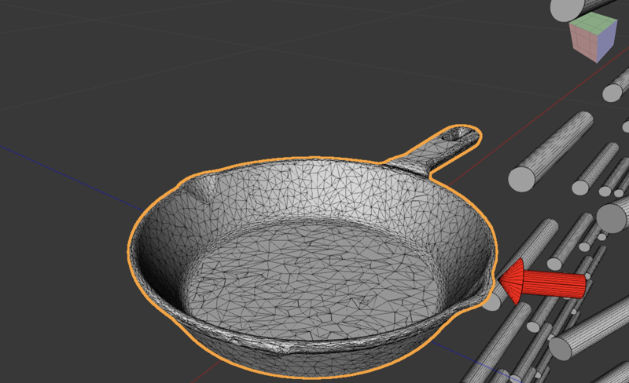 | [Impact](audio_samples/IronSkilletImpact.wav) | [Modal](audio_samples/IronSkilletModal.wav) |
| Plastic Scoop | 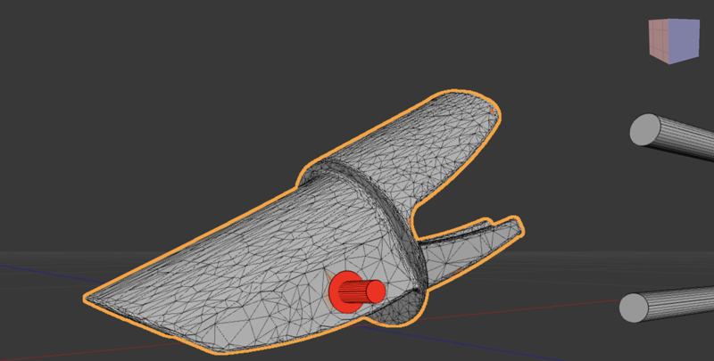 | [Impact](audio_samples/PlasticScoopImpact.wav) | [Modal](audio_samples/PlasticScoopModal.wav) |
| Small Swan Ceramic | 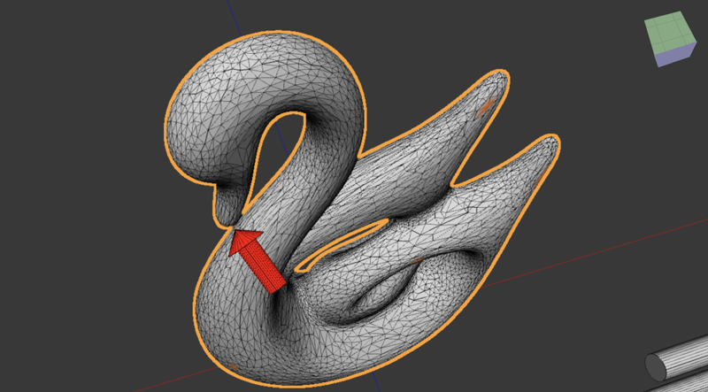 | [Impact](audio_samples/SmallSwanCeramicImpact.wav) | [Modal](audio_samples/SmallSwanCeramicModal.wav) |

## Build & run

### Install dependencies

- Download and install the latest SDK from https://vulkan.lunarg.com/sdk/home
- Set the `VULKAN_SDK` environment variable.
  For example, add the following to your `.zshrc` file:
  ```shell
  export VULKAN_SDK="$HOME/VulkanSDK/{version}/macOS"
  ```

#### Mac

```shell
$ git clone --recursive git@github.com:khiner/MeshEditor.git
$ brew install cmake pkgconfig llvm sdl3 fftw eigen
$ brew link llvm --force
```

#### Linux

(Only tested on Ubuntu, and it's been awhile, so I'd honestly be suprised if it works.
If you want a Linux build, I'd be happy to get this working!)

```shell
$ sudo apt install llvm sld3 libeigen3-dev
$ export PATH="$(llvm-config --bindir):$PATH"
```

Install GTK (for native file dialogs):

```shell
$ sudo apt install build-essential libgtk-3-dev
```

### Clone, clean, build, and run

```shell
$ git clone --recurse-submodules git@github.com:khiner/MeshEditor.git
$ cd MeshEditor
$ ./script/Clean # optionally clean first
$ ./script/Build [--release]
$ cd build && ./MeshEditor
```

## Stack

- [Vulkan](https://www.vulkan.org/) + [ImGui](https://github.com/ocornut/imgui) + [SDL3](https://github.comlibsdl-org/SDL): Graphics + immediate-mode UI/UX
- [glm](https://github.com/g-truc/glm): Small numeric vector/matrix types + math
- [entt](https://github.com/skypjack/entt): Entity Component System (ECS) for an efficient and scalable mixin-style architectural pattern
- [Faust](https://github.com/grame-cncm/faust): Functional audio programming language, used to render modal audio models to audio graphs
- [miniaudio](https://github.com/mackron/miniaudio): Audio stream I/O
- [tetgen](https://github.com/libigl/tetgen): Fast conversion of triangular 3D surface meshes into tetrahedral volume meshes
- [Spectra](https://github.com/yixuan/spectra) Estimate eigenvalues/vectors for modal analysis
- [VulkanMemoryAllocator](https://github.com/GPUOpen-LibrariesAndSDKs/VulkanMemoryAllocator): Efficient Vulkan memory allocation
- [nativefiledialog-extended](https://github.com/btzynativefiledialog-extended): Native file dialogs (TODO SDL3 now has `SDL_Dialog`)
- [ImPlot](https://github.com/epezent/implot): Plotting
- [fftw](https://www.fftw.org/) for computing spectrograms (visualized with ImPlot)
- [tinyobjloader](https://github.com/tinyobjloader/tinyobjloader) and [tinyply](https://github.com/ddiakopoulos/tinyply): Load `.obj` and `.ply` mesh files 
- [lunasvg](https://github.com/sammycage/lunasvg): Render Faust SVGs to bitmaps, parse SVG link bounding boxes, render SVG icons


## Development

### Update submodules

All submodules are in the `lib` directory.
Currently, no submodules are forked.
Here is my process for updating to the tip of all the submodule branches:

```sh
$ git submodule update --remote lib/{submodule}
$ git add .
$ git cm -m "Update {submodule} ..."
```
