# Mesh Audio Editor

Real-time mesh viewer and editor supporting conversion of meshes to rigid body audio models using Linear Modal Analysis/Synthesis.


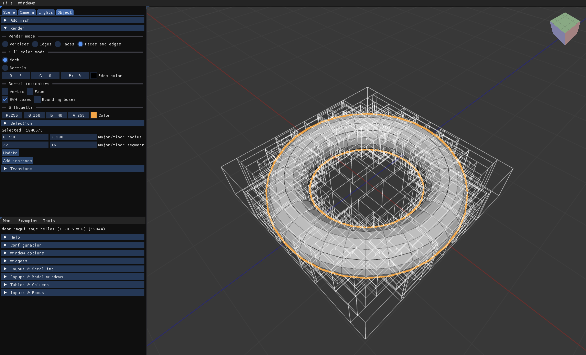
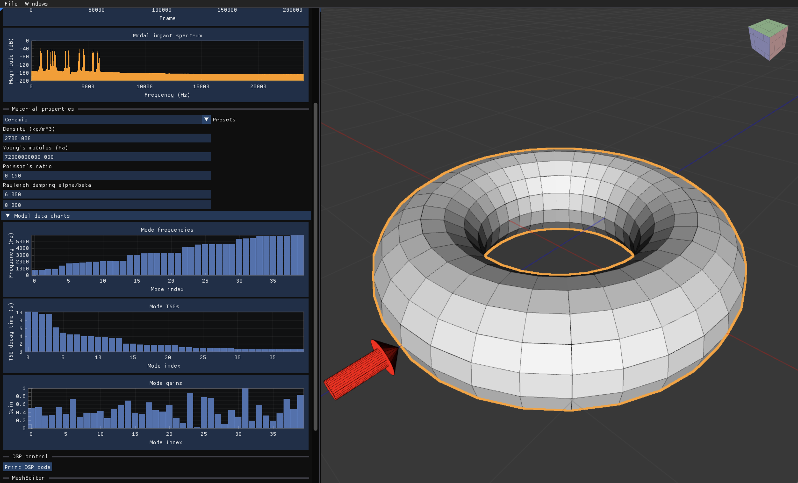
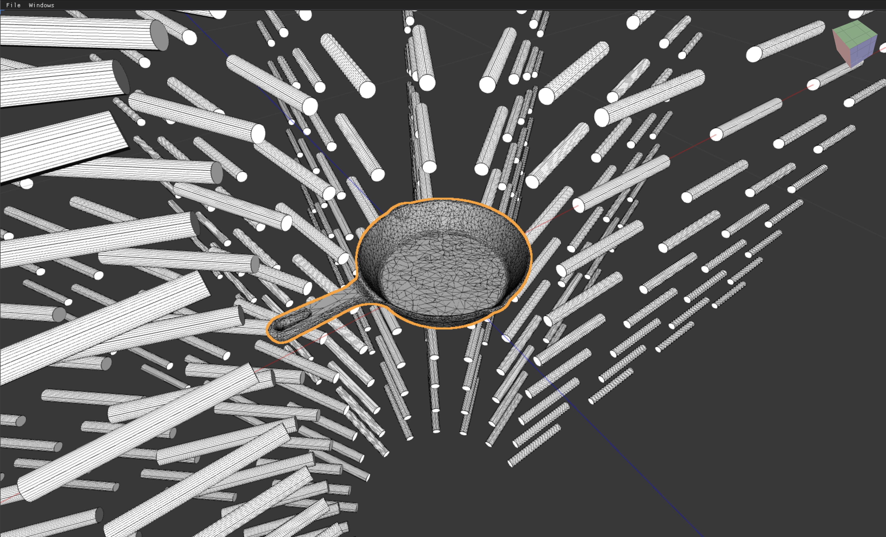
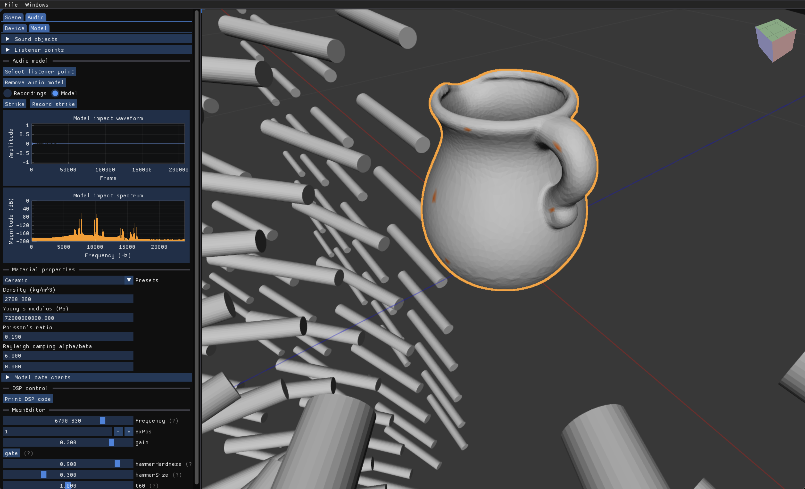
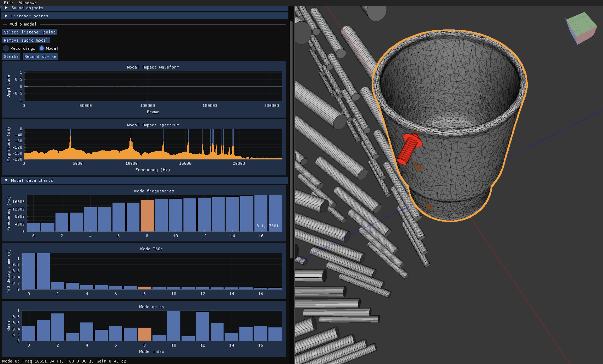

### Features

General features:
* Create/delete meshes and mesh instances
  - Editable mesh primitives (Rect, Circle, Cube, IcoSphere, UVSphere, Torus, Cylinder, Cone)
  - Load `.obj` and `.ply` mesh files (via [tinyobjloader](https://github.com/tinyobjloader/tinyobjloader) and [tinyply](https://github.com/ddiakopoulos/tinyply))
* Select meshes or mesh elements (vertices, edges, or faces), with click or box-select, and optional x-ray mode (to ignore occlusion), in real-time with fast GPU acceleration
* Flat/smooth/wireframe mesh rendering
* Translate / rotate / (nonuniformly) scale meshes and instances with numeric inputs or a custom transform gizmo designed to look and behave just like Blender's
* Edit camera with mouse wheel, numeric inputs, or with a custom orientation gizmo designed to look and behave just like Blender's
* Simple camera + scene lighting model, roughly matching Blender visually
* Edit lighting parameters
* Render face/vertex normals as lines for debugging
* Render bounding box wireframes for debugging
* Edge-detection-based silhouette outline of active mesh/instance, embedded into the scene with accurate per-pixel depth
* Fast infinite grid with horizon fade

Audio-specific features:
* Enable/disable audio output and change device and native format/sample rate
* Volume / Mute
* Generate an efficient physical audio model for any mesh. (See [Physical audio modeling](#physical-audio-modeling).)
  - Click on an audio mesh to excite the nearest vertex, or trigger a selected vertex in the audio menu
  - Strike any number of objects and vertices concurrently (polyphonic modal synthesis)
  - Edit synth params (gain, fundamental frequency, decay scale, click level) in real-time
* Load [RealImpact](https://samuelpclarke.com/realimpact/) datasets, including the object mesh and instanced cylinders for each microphone position.

Noteworthy dev bits:
* Terse and direct usage of [Vulkan-Hpp](https://github.com/KhronosGroup/Vulkan-Hpp)
 * Bindless rendering with descriptor-indexed SSBO vertex pulling (not BDA/buffer-reference vertex pulling yet) from contiguous arenas for mesh data (vertices, indices, attributes, selection state, etc.)
* Multi-Draw Indirect rendering (MDI): Each pipeline issues one `vkCmdDrawIndexedIndirect` per render pass (when used)
* Uses unified CPU/GPU memory when available. For discrete GPUs, minimizes staging transfers by deferring and merging copy ranges per-frame
* GPU-accelerated mouse interactions (no CPU acceleration structures like BVH)
* Half-edge iterators for mesh topology operations
* Shader hot reloading: Edit shader code and recompile/reload GLSL->SPIRV at runtime in the UI
* C++/GLSL structs generated from YAML to keep types in sync w/o duplication

### Physical audio modeling

This project supports generating an efficient physical audio model for any mesh using Linear Modal Analysis/Synthesis

The physical audio modeling was originally implemented as a final project for PHYS-6260 - Computational Physics at Georgia Tech during my Master's.
It's gotten a lot of work since then. The basics of the model generation process laid out in [the final report](paper/PAMofPassiveRigidBodies.pdf) and this 36X48 poster still hold, but the synthesis architecture has since been replaced (see below).

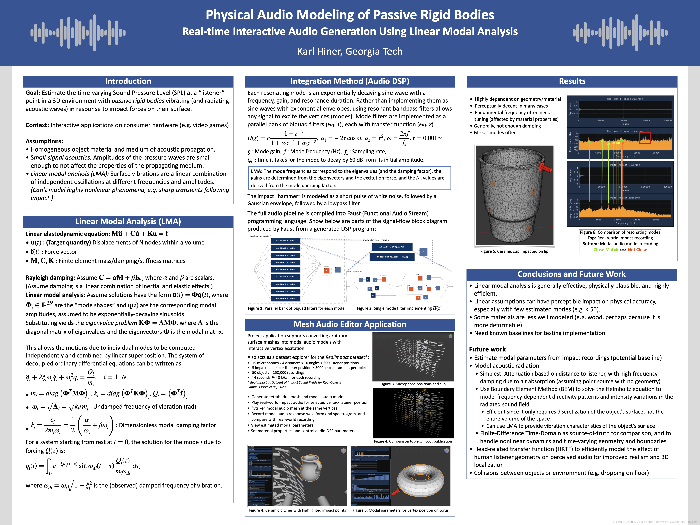

The report and poster describe rendering modal models with [Faust](https://github.com/grame-cncm/faust): MeshEditor generated Faust DSP code from the modal analysis results and JIT-compiled it to a native audio graph with LLVM.
Faust has since been replaced with a custom modal resonator bank to support many simultaneously sounding objects with physics collision impacts.
The last commit using Faust code generation is [31a817dd](https://github.com/khiner/MeshEditor/commit/31a817ddf1fd28d1b7aa1724e3e166b9c0eb58e4).

#### Impact audio experiments

Below are audio examples synthesized by "striking" modal audio models (by injecting a short wideband pulse at the selected vertex) for various meshes, with comparisons to impact recordings of their real-world counterparts being struck at the same position.
The audio recordings and 3D-scanned meshes come from the [RealImpact](https://samuelpclarke.com/realimpact/) dataset.
See [the blog post](https://karlhiner.com/mesh_audio_editor) for embedded audio players.

_The cylinders shown in the images represent recorded microphone positions, but all recordings come from a single microphone centered near the impacted object, and the modal audio model does not implement any audio wave radiation modeling. All modal audio samples are generated by extracting estimated surface vibrations, as if recorded from a contact microphone._

| Object Name | Mesh | Real Impact Audio | Modal Impact Audio |
|-|-|-|-|
| Ceramic Koi Bowl | 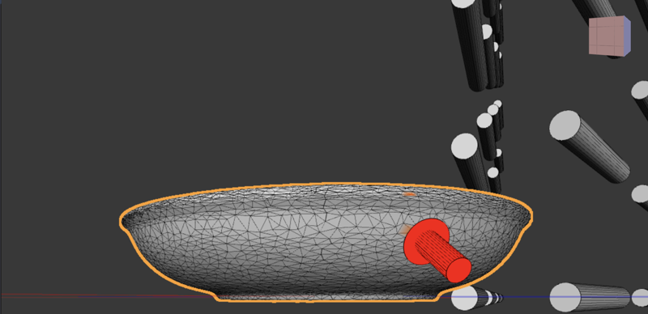 | [Impact](audio_samples/CeramicKoiBowlImpact.wav) | [Modal](audio_samples/CeramicKoiBowlModal.wav) |
| Ceramic Pitcher | 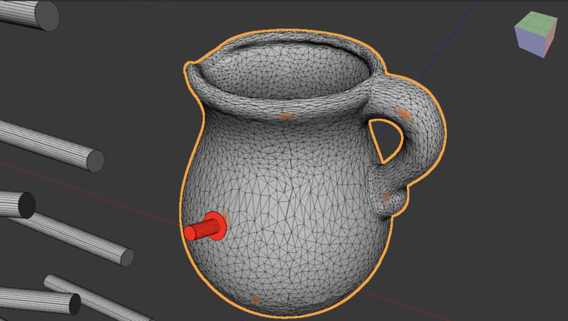 | [Impact](audio_samples/PitcherCeramicImpact.wav) | [Modal](audio_samples/PitcherCeramicModal.wav) |
| Glass Cup | 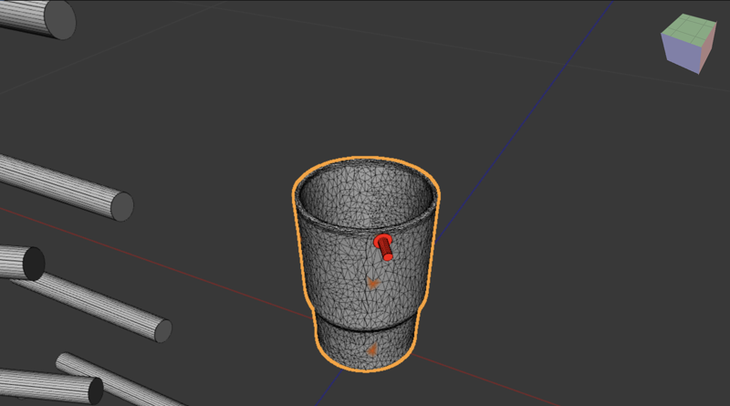 | [Impact](audio_samples/CupImpact.wav) | [Modal](audio_samples/CupModal.wav) |
| Iron Mortar | 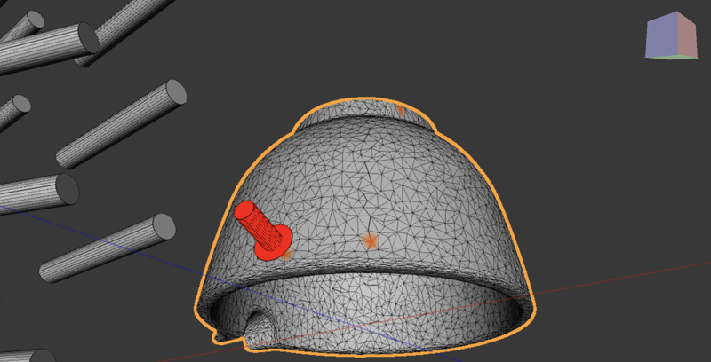 | [Impact](audio_samples/IronMortarImpact.wav) | [Modal](audio_samples/IronMortarModal.wav) |
| Iron Skillet | 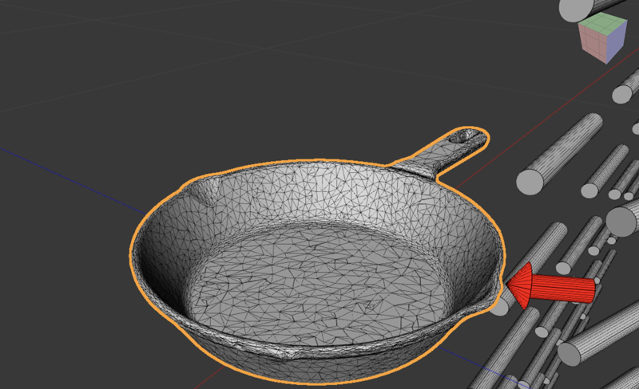 | [Impact](audio_samples/IronSkilletImpact.wav) | [Modal](audio_samples/IronSkilletModal.wav) |
| Plastic Scoop | 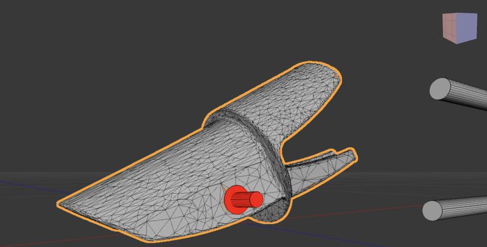 | [Impact](audio_samples/PlasticScoopImpact.wav) | [Modal](audio_samples/PlasticScoopModal.wav) |
| Small Swan Ceramic | 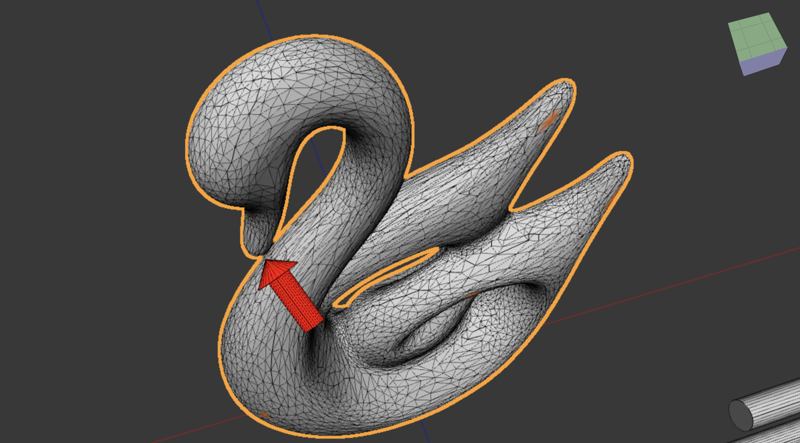 | [Impact](audio_samples/SmallSwanCeramicImpact.wav) | [Modal](audio_samples/SmallSwanCeramicModal.wav) |

### glTF viewer

MeshEditor is also a fully featured glTF 2.0 viewer/editor/exporter.
glTF scene nodes are mapped to corresponding MeshEditor objects (meshes, armatures, cameras, lights, empty objects), with the scene parenting hierarchy mirroring the glTF node hierarchy.
All Khronos ratified extensions that visually impact the scene are supported (imported, rendered, fully editable).
Load/save roundtrips almost all glTF losslessly, with known exceptions listed in `tests/RoundtripTest.cpp`.
PBR BRDF/lighting equations are taken directly from the reference [glTF-Sample-Renderer shaders](https://github.com/KhronosGroup/glTF-Sample-Renderer/blob/main/source/Renderer/shaders/).

PBR render features that are not needed by the scene (because the feature isn't enabled on any current object's materials, scene lights are not present or enabled, or IBL environment not present (in Solid render mode)) are not compiled. This is updated dynamically as the scene changes or edits are made.
(This is implemented with specialization constants, so only the VkPipeline variants (opaque/blend) need to be recreated, and no GLSL->SPIR-V recompilation is needed for the PBR shader. This is fast enough to run synchronously whenever the enabled feature mask changes - usually around 60ms on my machine.)

#### glTF supported extensions

✅ supported | 🟨 partial | ⬜ not supported
| Extension | Status | Notes |
| - | - | - |
| `KHR_mesh_quantization` | ✅ | Handled in fastgltf parser/import path |
| `EXT_mesh_gpu_instancing` | ✅ | Imported into MeshEditor instances |
| `KHR_lights_punctual` | ✅ | Imported into MeshEditor light entities |
| `KHR_texture_transform` | ✅ | |
| `KHR_texture_basisu` | ✅ | KTX2 transcoded via [basis_universal](https://github.com/BinomialLLC/basis_universal). BC7/ETC2/RGBA32 target selected based on device support |
| `EXT_texture_webp` | ✅ | Decoded via [libwebp](https://github.com/webmproject/libwebp). Edited textures re-encode to lossless WebP on export |
| `KHR_materials_emissive_strength` | ✅ | |
| `KHR_materials_unlit` | ✅ | |
| `KHR_materials_specular` | ✅ | |
| `KHR_materials_sheen` | ✅ | |
| `KHR_materials_ior` | ✅ | |
| `KHR_materials_dispersion` | ✅ | |
| `KHR_materials_transmission` | ✅ | "Real transmission" toggle in Viewport Shading: on samples a pre-rendered scene texture; off samples the IBL. |
| `KHR_materials_diffuse_transmission` | ✅ | |
| `KHR_materials_volume` | ✅ | |
| `KHR_materials_clearcoat` | ✅ | |
| `KHR_materials_anisotropy` | ✅ | |
| `KHR_materials_iridescence` | ✅ | |
| `KHR_materials_variants` | ✅ | |
| `KHR_physics_rigid_bodies` | ✅ | (not yet ratified) |
| `KHR_implicit_shapes` | 🟨 | (not yet ratified) WIP |
| `KHR_node_visibility` | ✅ | Load and roundtrip are conformant. However, hiding a parent in the app without also hiding its descendants is dropped, since glTF can't express "parent invisible, children visible." |
| `KHR_animation_pointer` | ⬜ | Too much complexity for now, will add when I get to arbitrary property animation. |
| `EXT_lights_image_based` | ✅ | Imported as Scene IBL when present |
| `EXT_meshopt_compression` | ✅ | Compressed bufferViews decoded via [meshoptimizer](https://github.com/zeux/meshoptimizer) at import; geometry re-emits uncompressed on export |

## Build & run

### Install dependencies

- Download and install the latest SDK from https://vulkan.lunarg.com/sdk/home
- Set the `VULKAN_SDK` environment variable.
  For example, add the following to your `.zshrc` file:
  ```shell
  export VULKAN_SDK="$HOME/VulkanSDK/{version}/macOS"
  ```

#### Mac

```shell
$ git clone --recursive git@github.com:khiner/MeshEditor.git
$ brew install cmake pkgconfig llvm sdl3 fftw eigen
$ brew link llvm --force
```

#### Linux

(Only tested on Ubuntu, and it's been awhile, so I'd honestly be suprised if it works.
If you want a Linux build, I'd be happy to get this working!)

```shell
$ sudo apt install llvm sld3 libeigen3-dev
$ export PATH="$(llvm-config --bindir):$PATH"
```

Install GTK (for native file dialogs):

```shell
$ sudo apt install build-essential libgtk-3-dev
```

### Clone, clean, build, and run

```shell
$ git clone --recurse-submodules git@github.com:khiner/MeshEditor.git
$ cd MeshEditor
$ ./script/Clean # optionally clean first
$ ./script/Build [--release]
$ cd build && ./MeshEditor [file|--empty] [--quiet|-q] [--headless] [--play [seconds]] [--record path.mp4 [--fps N]] [--screenshot path.webp] [--render basename]
```

* `file` can be a `.gltf`, `.glb`, `.obj`, `.ply`, `.state` (scene snapshot), or `.actions` (replayed action log). No file loads the default scene.
* `--empty` starts with an empty scene instead of the default scene.
* `--quiet` / `-q` suppresses timer output.
All of `--play`, `--record`, and `--screenshot` use the presentation look (material preview shading, overlays hidden). `--play` and `--record` also run the animation/physics; `--screenshot` holds the first frame.

* `--play [seconds]` starts playback. Optional `[seconds]` auto-exits after the given duration. See `--record` below for how the duration is interpreted.
* `--record path.mp4` runs playback and writes the viewport as an H.264 `.mp4` via a `ffmpeg` subprocess (must be on `PATH`).
When a look-through camera is active, only the camera-frame sub-rect (the area inside the dimmed overlay) is recorded. Otherwise the full viewport is recorded.
* `--fps N` sets the recording framerate (default 60).
* `--screenshot path.webp` writes a single image. The format is chosen by extension (`.webp` lossless, `.png`, `.jpg`/`.jpeg`), which is optional and defaults to `.webp`. The captured region matches `--record`. On its own it exits after writing; combined with `--play [seconds]` or `--record` it grabs the frame and keeps running.
* `--render basename` writes the scene's corpus artifacts under `basename.*` (used by `./script/Render` — see [Render corpus](#render-corpus)).
* `--render-queue dir` renders one scene per `dir/*.job` file (`basename<TAB>scene arg`) in a single headless process, and parallel workers can safely share one queue. Used by `./script/Render`, combinable only with `-q`.
* `--headless` runs without a window: the viewport renders offscreen at a fixed 1280x800 (2x pixel density) extent, and any capture flags read it back. Without a capture flag it renders one frame and exits, and a duration-less `--play` exits after one timeline loop.

The flags can be combined freely, except `--render` excludes `--record` and `--screenshot` (it derives its own outputs). `--render --play N` caps the video at N seconds.

**Timing**: interactively, the sim runs at wall-clock rate. Recording samples the viewport at `fps`, so the file plays at the same rate as the in-app preview. `--play N` exits after N seconds — wall-clock when interactive, video-seconds when recording. Headless runs (and `--render` anywhere) are instead fixed-step and GPU-paced: one timeline frame per tick with every tick captured, so output is deterministic and `--fps` is unused.

### Render corpus

`render/` holds committed demo output for every scene in the corpus, mirroring the source layout: the built-in Empty and Default scenes, the `res/examples/` projects, and the glTF samples under `external/`. (The redundant `glTF-Binary` and `glTF-Embedded` variants are skipped since they render identically.)
Each leaf has a visual (lossless `.webp` for static scenes, plus one per material variant, `.mp4` for animated ones - one timeline loop per animation clip, back-to-back), the `.actions` replay log, a `.log` of console output, and a `run.sh` that opens that scene in the app.

Binary artifacts are stored in [git-lfs](https://git-lfs.com); fetch them after cloning:
```shell
$ git lfs install
$ git lfs pull
```

Regenerate the corpus with `./script/Render`.
Scenes render headless (no window or display needed) and in parallel (`JOBS` sets the worker count, default 8). It needs the glTF submodules, plus `ffmpeg` on `PATH` for videos.
Rendering is fixed-step (one tick per timeline frame) and GPU-paced at a fixed extent, so artifacts are deterministic: after regenerating, `git status` shows only scenes whose rendering actually changed.

## Stack

- [Vulkan](https://www.vulkan.org/) + [ImGui](https://github.com/ocornut/imgui) + [SDL3](https://github.comlibsdl-org/SDL): Graphics + immediate-mode UI/UX
- [glm](https://github.com/g-truc/glm): Small numeric vector/matrix types + math
- [entt](https://github.com/skypjack/entt): Entity Component System (ECS) for an efficient and scalable mixin-style architectural pattern
- [miniaudio](https://github.com/mackron/miniaudio): Audio stream I/O
- [tetgen](https://github.com/libigl/tetgen): Fast conversion of triangular 3D surface meshes into tetrahedral volume meshes
- [Spectra](https://github.com/yixuan/spectra) Estimate eigenvalues/vectors for modal analysis
- [VulkanMemoryAllocator](https://github.com/GPUOpen-LibrariesAndSDKs/VulkanMemoryAllocator): Efficient Vulkan memory allocation
- [fastgltf](https://github.com/spnda/fastgltf) glTF 2.0 scene loading
- [JoltPhysics](https://github.com/jrouwe/JoltPhysics): Rigid body physics
- [basis_universal](https://github.com/BinomialLLC/basis_universal) KTX2 texture transcoding (`KHR_texture_basisu`)
- [libwebp](https://github.com/webmproject/libwebp) WebP texture decoding and lossless snapshot/texture encoding (`EXT_texture_webp`)
- [tinyobjloader](https://github.com/tinyobjloader/tinyobjloader) and [tinyply](https://github.com/ddiakopoulos/tinyply): `.obj` and `.ply` mesh loading
- [lunasvg](https://github.com/sammycage/lunasvg): Render SVG icons to bitmaps
- [fftw](https://www.fftw.org/) compute spectrograms (visualized with ImPlot)
- [ImPlot](https://github.com/epezent/implot): Plotting
- [boost-ext/ut](https://github.com/boost-ext/ut): Testing

## Development

### Build options

**Staged buffer transfers**: By default, the app assumes unified memory (direct-mapped GPU memory).
For discrete GPUs, enable staged transfers:
```shell
$ cmake -B build -DMVK_FORCE_STAGED_TRANSFERS=ON .
```

**glTF sample submenus**: [glTF-Sample-Assets](https://github.com/KhronosGroup/glTF-Sample-Assets) and [glTF_Physics](https://github.com/eoineoineoin/glTF_Physics) are git submodules under `external/`, populating `File > glTF Samples` and `File > glTF_Physics Samples`. These submenus are empty if the submodules aren't initialized:
```shell
$ git submodule update --init external/glTF-Sample-Assets external/glTF_Physics
```

**Quiet mode**: Disable timer output at compile time (equivalent to always passing `--quiet`):
```shell
$ cmake -B build -DQUIET=ON .
```

### Tests

Unit tests, including glTF roundtrip tests.
The roundtrip tests require the `external/glTF-Sample-Assets` and `external/glTF_Physics` submodules (see above).

```shell
$ ./script/Build --test
$ ./build/tests/MeshEditorTests
```

### Update submodules

Submodules live in `lib` (libraries) and `external` (glTF sample assets).
Here is my process for updating to the tip of all the submodule branches:

```sh
$ git submodule update --remote {path}/{submodule}
$ git add .
$ git cm -m "Update {submodule} ..."
```
