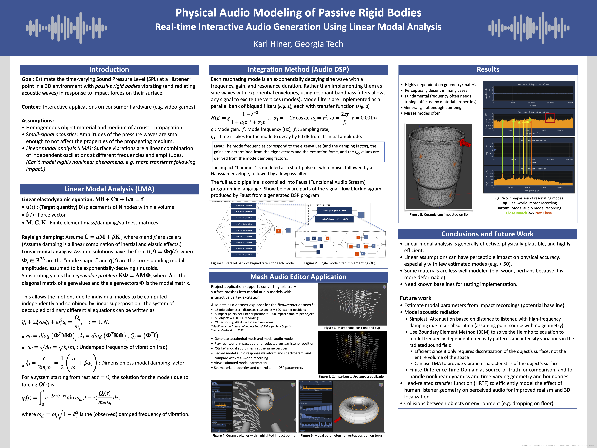
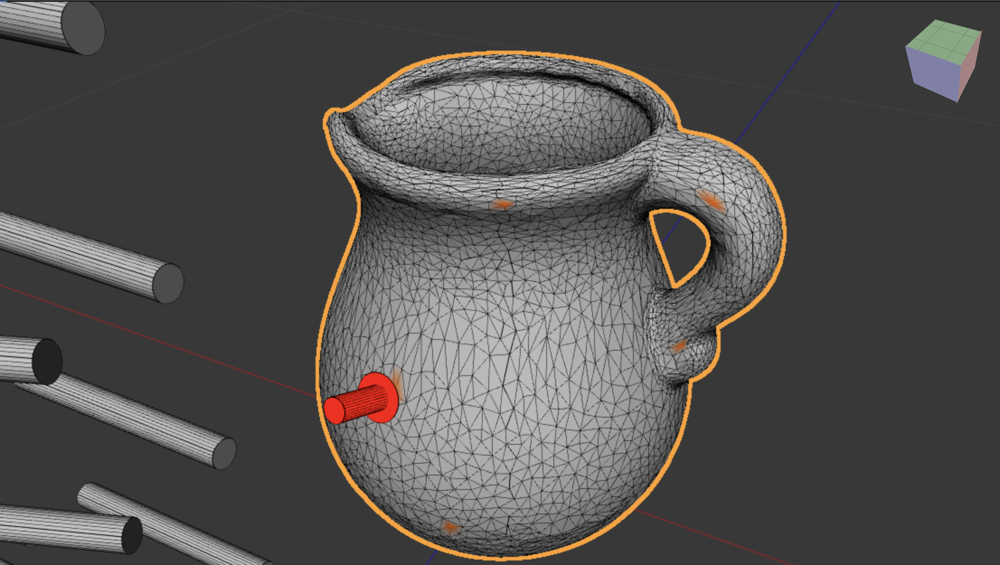

# MeshEditor

Real-time mesh viewer and editor, using Vulkan and ImGui, and in-progress rigid body audio model.


### Physical audio modeling

This project supports generating an efficient physical audio model for any mesh, using Linear Modal Analysis/Synthesis

Here is a 36X48 poster on the topic I created on the topic:



### Impact audio experiments

Below are audio examples of "striking" modal audio models for various meshes, with comparisons to impact recordings of their real-world counterparts being struck at the same position.
The audio recordings and 3D-scanned meshes come from the [RealImpact](https://samuelpclarke.com/realimpact/) dataset.

_The cylinders shown in the images represent recorded microphone positions, but all recordings come from a single, centered microphone near the impacted object, and the modal audio model does not implement any audio wave radiation modeling. All modal audio samples are generated by extracting estimated surface vibrations, as if recorded from a contact microphone._

| Object Name | Mesh | Real Impact Audio | Modal Impact Audio |
|-|-|-|-|
| Ceramic Koi Bowl |  | [Impact](audio_samples/CeramicKoiBowlImpact.wav) | [Modal](audio_samples/CeramicKoiBowlModal.wav) |
| Ceramic Pitcher |  | [Impact](audio_samples/PitcherCeramicImpact.wav) | [Modal](audio_samples/PitcherCeramicModal.wav) |
| Glass Cup |  | [Impact](audio_samples/CupImpact.wav) | [Modal](audio_samples/CupModal.wav) |
| Iron Mortar |  | [Impact](audio_samples/IronMortarImpact.wav) | [Modal](audio_samples/IronMortarModal.wav) |
| Iron Skillet |  | [Impact](audio_samples/IronSkilletImpact.wav) | [Modal](audio_samples/IronSkilletModal.wav) |
| Plastic Scoop |  | [Impact](audio_samples/PlasticScoopImpact.wav) | [Modal](audio_samples/PlasticScoopModal.wav) |
| Small Swan Ceramic |  | [Impact](audio_samples/SmallSwanCeramicImpact.wav) | [Modal](audio_samples/SmallSwanCeramicModal.wav) |

### Features

General features:
* Create/delete meshes and mesh instances
  - Editable mesh primitives (Rect, Circle, Cube, IcoSphere, UVSphere, Torus, Cylinder, Cone)
  - Load `.obj`, `.off`, `.ply`, `.stl` and `.om` mesh files (via [OpenMesh](https://gitlab.vci.rwth-aachen.de:9000/OpenMesh/OpenMesh))
* Select meshes or mesh elements (vertices, edges, or faces) with mouse
* Flat/smooth/wireframe mesh rendering
* Bounding Volume Hierarchy (BVH) ray intersection acceleration structure
  - Used for mouse interactions - this is not a ray tracing renderer :)
* Translate / rotate / (nonuniformly) scale meshes and instances with [gizmo]([ImGuizmo](https://github.com/CedricGuillemet/ImGuizmo)) and numeric inputs
* Simple camera + scene lighting model, roughly matching Blender visually
* Edit camera with:
  - Camera rotate cube [gizmo]([ImGuizmo](https://github.com/CedricGuillemet/ImGuizmo))
  - Scrollwheel zoom
  - Numeric inputs
* Edit lighting parameters
* Render face/vertex normals as lines for debugging
* Render bounding box / BVH wireframes for debugging
* Edge-detection-based silhouette outline of selected mesh/instance, embedded into the scene with accurate per-pixel depth
* Fast infinite grid with horizon fade

Audio-specific features:
* Enable/disable audio output and change device and native format/sample-rate
* Volume / Mute
* Load [RealImpact](https://samuelpclarke.com/realimpact/) datasets, including the object mesh and instanced cylinders for each microphone position.
* Generate an efficient physical audio model for any mesh. (See [Physical audio modeling](#physical-audio-modeling).)

Noteworthy dev bits:
* Terse and direct usage of [Vulkan-Hpp](https://github.com/KhronosGroup/Vulkan-Hpp)
* Change SPIRV shader code and trigger a runtime recompile in the UI
* Resource reflection: Use [`SPIRV-Cross`](https://github.com/KhronosGroup/SPIRV-Cross) to automatically create descriptor set layout bindings for all shader pipelines
* Instanced rendering of shared geometry with variable transforms

## Build app

### Install dependencies

- Download and install the latest SDK from https://vulkan.lunarg.com/sdk/home
- Set the `VULKAN_SDK` environment variable.
  For example, add the following to your `.zshrc` file:
  ```shell
  export VULKAN_SDK="$HOME/VulkanSDK/{version}/macOS"
  ```

#### Mac

```shell
$ git clone --recursive git@github.com:khiner/MeshEditor.git
$ brew install cmake pkgconfig llvm fftw
$ brew link llvm --force
```

#### Linux

(Only tested on Ubuntu.)

```shell
$ sudo apt install llvm libc++-dev libc++abi-dev
$ ln -s llvm-config-17 llvm-config
$ export PATH="$(llvm-config --bindir):$PATH"
```

Install GTK (for native file dialogs):

```shell
$ sudo apt install build-essential libgtk-3-dev
```

### Clone, clean, and build app

```shell
$ git clone --recurse-submodules git@github.com:khiner/MeshEditor.git
$ cd MeshEditor
$ mkdir build && cd build && cmake .. && make
```

## Stack

- [Vulkan](https://www.vulkan.org/) + [ImGui](https://github.com/ocornut/imgui) + [SDL3](https://github.comlibsdl-org/SDL): Graphics + immediate-mode UI/UX
- [glm](https://github.com/g-truc/glm): Small numeric vector/matrix types + math
- [OpenMesh](https://gitlab.vci.rwth-aachen.de:9000/OpenMesh/OpenMesh): Main polyhedral (half-edge) mesh data structure
- [entt](https://github.com/skypjack/entt): Entity Component System (ECS) for an efficient and scalable mixin-style architectural pattern
- [miniaudio](https://github.com/mackron/miniaudio): Audio stream I/O
- [fftw](https://www.fftw.org/) for computing spectrograms (visualized with ImPlot)
- [Faust](https://github.com/grame-cncm/faust): Functional audio programming language, used to render an object audio model to an audio graph
- [tetgen](https://github.com/libigl/tetgen): Fast conversion of triangular 3D surface meshes into tetrahedral volume meshes
- 3D FEM: [VegaFEM](https://github.com/grame-cncm/faust/tree/master-dev/tools/physicalModeling/mesh2faust/vega) for generating mass/stiffness matrices from tet mesh + [Spectra](https://github.com/yixuan/spectra) for estimating eigenvalues/vectors
- [VulkanMemoryAllocator](https://github.com/GPUOpen-LibrariesAndSDKs/VulkanMemoryAllocator): Efficient Vulkan memory allocation
- [nativefiledialog-extended](https://github.com/btzynativefiledialog-extended): Native file dialogs (TODO SDL3 now has `SDL_Dialog`)
- [ImPlot](https://github.com/epezent/implot): Plotting
- [ImGuizmo](https://github.com/CedricGuillemet/ImGuizmo): Mesh transform and camera rotation gizmos
